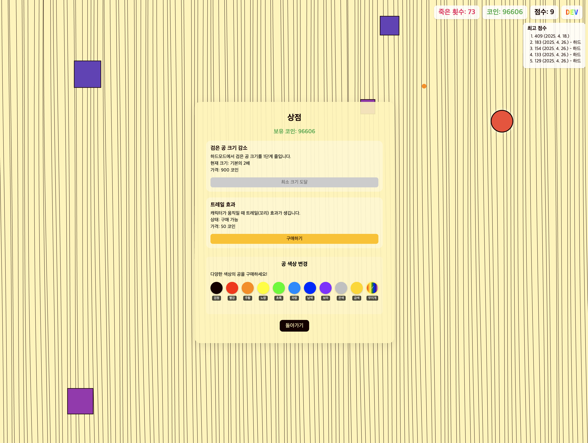

# 웨이브 서퍼 게임



물결 위를 서핑하며 장애물을 피하는 간단하고 중독성 있는 웹 게임입니다.

## 게임 방법

1. 마우스 커서가 검은색 공이 됩니다
2. 마우스를 움직여 화면에 나타나는 장애물을 피하세요
3. 커서가 장애물과 충돌하면 게임 오버됩니다
4. 생존 시간이 길수록 높은 점수를 얻습니다
5. 점수에 따라 코인을 획득할 수 있습니다

## 게임 모드

- **쉬움 모드**: 장애물이 천천히 움직이고 크기가 작습니다
- **어려움 모드**: 장애물이 빠르게 움직이고 크기가 큽니다

## 주요 기능

### 점수 시스템
- 생존 시간에 따라 점수가 증가
- 게임 모드별 최고 점수 기록
- 점수에 비례하여 코인 획득

### 상점 시스템
- 코인으로 다양한 아이템 구매 가능
- 커서 색상 변경 (기본, 빨강, 주황, 노랑, 초록, 파랑 등)
- 커서 크기 감소 기능으로 난이도 조절

### 기타 기능
- 로컬 스토리지를 활용한 게임 데이터 저장
- 게임 모드별 난이도 설정
- 개발자 모드 (숨겨진 기능)

## 최근 업데이트

- 트레일 관련 기능 제거
- UI 개선
- 게임 성능 최적화

## 기술 스택

- HTML5
- CSS3
- JavaScript (ES6+)
- SVG 애니메이션
- LocalStorage API

## 설치 및 실행

1. 저장소 클론하기:
   ```
   git clone https://github.com/yourusername/wavy-game.git
   ```

2. 브라우저에서 `index.html` 열기

## 개발자 정보

이 게임은 웹 기술을 활용한 인터랙티브 경험을 제공하기 위해 만들어졌습니다. 